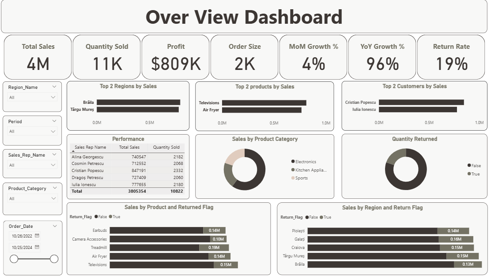
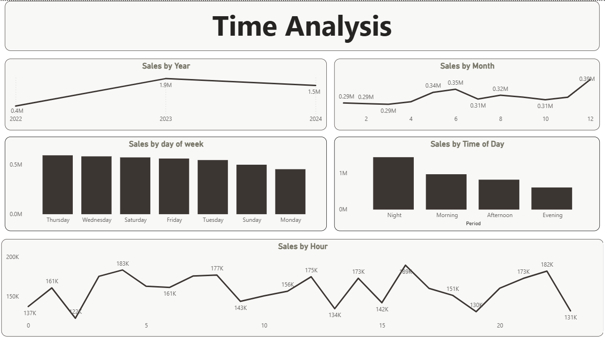

# Sales Dashboard – DEPI Case Study (Power BI)

This is a Power BI case study project created using real-world sales data provided by DEPI. The goal was to build an interactive and insightful dashboard to analyze sales performance, track KPIs, and identify areas for improvement.

## 📊 Dashboard Highlights

- Total Sales, Profit, Quantity Sold, and Average Order Size
- Month-over-Month (MoM) and Year-over-Year (YoY) Sales Growth
- Return Rate (%) and Product-wise Return Analysis
- Sales by:
  - Time of Day (Morning, Afternoon, Evening, Night)
  - Day of the Week (Best: Thursday, Lowest: Monday)
  - Month (Peak: December, Lowest: Jan–Mar)
- Top Performing:
  - Products: Televisions & Air Fryers
  - Regions: Brăila & Târgu Mureș
  - Customers: Only two major contributors
- Sales Representative Ranking

## 💡 Key Insights

- High return rate of 19%
- Treadmill had the highest return rate at 24%
- Majority of sales come from two regions and two customers
- Electronics category leads total sales
- Peak sales time is at night; lowest is in the evening

## ✅ Recommendations

- Investigate reasons behind high return rates through customer feedback
- Offer product discounts on low-sale days to boost volume
- Expand customer base to reduce dependency
- Improve product quality for items with high returns
- Incentivize underperforming sales reps
- Target peak hours and best-selling months with special promotions
## 📸 Dashboard Screenshots

### 📍 Overview Dashboard

### ⏰ Time Analysis Dashboard

Built with ❤️ using **Power BI**  
